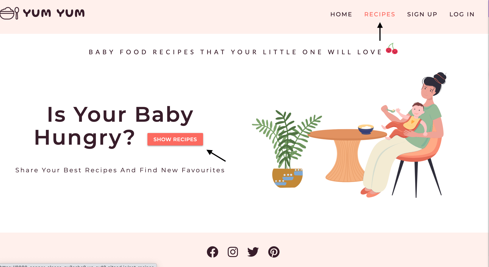

# Testing  

## Validator Testing  

### HTML Testing
https://validator.w3.org/ -

### CSS Testing 
https://jigsaw.w3.org/css-validator/ - 

### JS Testing
https://jshint.com/ - 

### Python
http://pep8online.com/ - I checked the app.py file using PEP8 online

### Accessibility test
https://wave.webaim.org - 

---  

## Testing User Stories

- ### *As a user I easily want to find good and healthy recipes that I can make for my baby*   

All users who visits the website can view the recipes without having an account or log in. They can navigate through the navbar or use the "show recipes" button on the landing page.

  

  

---    

- ### *As a user I want to be able to search for a specific ingredient in the recipes*  

Users can use the search bar on the recipe page. Search results comes from ingredients in the recipe or the name of the recipe  

  

If there is a result it will show the recipes that includes that word    

  

If there's no match the line "No Results Found" is displayed    

  

---

- ### *As a user I want to be able to look for recipes sorted by category*  

Users can choose to either see all recipes or to filter them by the categories: *Breakfast*, *Lunch*, *Dinner* and *Snack*

  

---

- ### *As a user I want to be able to register my own account*  

From the navbar users can reach the Sign Up page where they can register to have their own account. There they choose a username and a password, if the username is already taken they will be informed with the line "Username already exists".

  

---

- ### *As a user I want to be able to log in to my account*  

After a user has been registered they can log in to their account through the Log In page located in the navbar

  

---

- ### *As a user I want to be able to log out of my account*  

Once the user is logged in they can log out of their account by clicking the Log Out link located in the navbar

  

---

- ### *As a user I want to upload my own recipes*  

Once the user is registered and have an account they can add their own recipes from their account page   

  

When they click the "Add Recipe" button they will be redirected to the Add Recipe page  

 

---

- ### *As a user I want to be able to edit my recipes*  

On the bottom of every recipe that the users has uploaded themselves there is an "edit" button.

  

When they click on the button they will be redirected to the edit recipe page. The input fields will be prefilled with the previous information added.

  

---

- ### *As a user I want to be able to delete my recipes*  

On the bottom of every recipe that the users has uploaded themselves there is a "delete" button.

  

To not delete anyting by mistake, a modal will appear where they need to confirm the deletion or cancel it

  

---

- ### *As a site admin I want to be able to add new categories to the site*  

When you're logged in as site admin you get an additional page in the navbar that's called "Manage Categories". From here the admin can add new categories.

  

---

- ### *As a site admin I want to be able to edit categories*  
When admin clicks the name of the category they wish to edit the "edit" button will appear  

  

When they click on the button they will be redirected to the edit category page. The input field will be prefilled with the previous information added  

  

---

- ### *As a site admin I want to be able to delete categories*  

Next to the "edit" button there is a "delete" button

To not delete anyting by mistake, a modal will appear where they need to confirm the deletion or cancel it  
  
---   
  
## During Development I Fixed The Following Bugs

### Card Display  

When a user added the ingredients to the recipes they've appeared on the same line instead of seperate lines which made it difficult to read. The same was for the instructions.  

 

 

- I wanted the ingredients and instructions to appear in a list. At first I had the `input` field
from Materialize then I changed it to `textarea` and added the class of .materialize-textarea so that when a user added an ingredient or a new step in the instructions they could just press enter to make a line break. I've also added a .helper-text for clarification.

- I've also added a for loop with list element so the ingredients/instructions could iterate through.  
Previous: `{{ recipe.category_name }}`  
Changed it to:  

        
             

                <ul>
                    <li>
                    {{ ingredient }}
                    </li>
                </ul>
            

        

- This solved the issue but now all the letters was on a new line.  
 

 
    - I added `.splitlines()`  
     = ``  and that fixed the issue.  

- The different steps for the instructions all have nr 1.   
 

 

-   moved for loop inside list item:
    
        

            <ol>
                
                <li>{{ steps }}</li>
                
            </ol>
        

instead of:  

        
        

            <ol>
                <li>{{ steps }}</li>
            </ol>
        

        

### Responsiveness issues  

- I've had some responsiveness issues with the search bar. On smaller devices the input field was very small and buttons overlapping.  
 

 
    - I've had added the Materialize class name `.valign-wrapper` because I wanted it to be vertically aligned. I removed this and kept the `.center-align` class and the buttons now appeared below the search bar on smaller devices making it much easier to fill out and search.

- Font weight for the logo "Yum Yum" was too big for iphone 5/SE making it appear on two lines. Even on Galaxy fold the logo jumped down a line.  

 

 
 

 

 - I added the class `.hide-on-small-only` from Materialize which hides the logo on small screens.
This actually made it look much cleaner and not so cluttered in the navbar.  

---  

## Lighthouse Testing

I ran the the site through Chrome Lighthouse when I considered myself almost done and the score was quite ok, there were just some minor issues that needed to be fixed.  
    - Add alt text to images  
    - Add `rel="noopener"` to social media links  
    - Add meta description to base.html  
 

 

After fixing the issues my score became much better
 

   

---  

## I Manually Tested The Following Features  

- Home  
    - All links in navbar takes you to the correct pages
    - Button "Show recipes" takes you to the recipe page
    - All links to social media platforms in footer opens in a new tab window   
    - Hover effect on links in navbar
- Recipes
    - Search function finds the correct recipes
    - "Reset" button clears the search bar
    - Links to the different categories displays the correct recipes
- Sign Up
    - Input fields displays the text to the user and hides the password
    - User being added to the database upon registration and redirects to account page
    - Error message "Username already exists" displays if you try to type in an already existing username
    - Link "Log In" leads to Log In page
- Log In
    - Input fields displays the text to the user and hides the password
    - "Log In" button redirects to account page
    - Link "Register Now" leads to Sign Up page
- Account
    - Users own recipes appears on their account page
    - "Add recipe" button redirects to add recipe page
    - "Edit" button redirects to edit recipe page
    - "Delete" button opens confirmation modal
        - "Yes" on modal deletes the recipe from database
        - "No" on modal close the modal without any changes being made
- Log Out
    - User being logged out from Account and redirected to Log In page
- Add recipe
    - All fields in form are being filled out as expected
    - Submitting the form will not work without all fields being filled out
    - If filled out correcly recipe is being added to the database and diaplays on account page and recipe page
    - Ingredients are being displayed in a list if you press enter after every ingredient
    - Instructions are being displayed in a ordered list if you press enter efter every step
    - "Cancel" button takes you back to account page
- Edit recipe
    - Form is prefilled with the previous information
    - "Cancel" button takes you back to recipe page
    - "Update recipe" button updates recipe in database
- Manage Categories
    - Only visible when Admin is logged in
    - All tabs open and displays an "edit" and "delete" button
    - "Edit" button redirects to edit category page
    - "Add new category" button redirects to add category page
     - "Delete" button opens confirmation modal
        - "Yes" on modal deletes the category from database
        - "No" on modal close the modal without any changes being made
- Edit Category
    - The category name is prefilled in the input field
    - "Cancel" button takes you back to manage categories page
    - "Update category" button updates category in database
- Add Category
    - Submitting the form will not work without the field being filled out
    - "Cancel" button takes you back to manage categories page
    - Category is being added to database and displays on managae category page and as an option for users when they add a new recipe  

## Testing Responsiveness  

To make sure that the site is responsive:
 - I manually tested it on all available devices in DevTools
 - I've used the site [Responsinator](http://www.responsinator.com/?url=baby-food.herokuapp.com%2Fhome)  

---  

